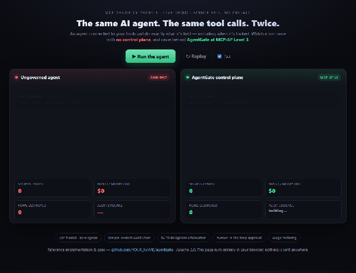
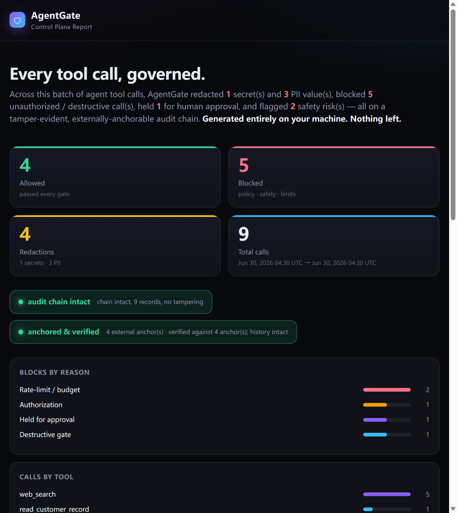

# 🛡️ AgentGate

[](./SPEC.md)

**A self-hosted control plane for AI agents.** It sits between your AI agent and the tools it calls (MCP servers / functions), and on **every single tool call** it enforces: **policy & governance · secret/PII redaction · dangerous-action blocking · rate-limit & budget caps · human-in-the-loop approval · real-time alerts · tamper-evident audit · structured tracing.**



*▶ [Open the live demo](web/danger.html) · single file, no install · runs entirely in your browser.*



> Your agents are wired to more and more tools (especially via MCP). The moment an agent can read data, hit APIs, or run commands, it can leak secrets, act without authorization, or take destructive actions — **silently, with no audit trail.** AgentGate is the gate every action passes through first.

> **▶ See it in 30 seconds:** [`web/danger.html`](web/danger.html) · [`web/audit.html`](web/audit.html) · [`web/compare.html`](web/compare.html) · Docs: [`docs/QUICKSTART.md`](docs/QUICKSTART.md) · [`LAUNCH_CHECKLIST.md`](LAUNCH_CHECKLIST.md)

---

## Why now · why this gap

In 2026 every company is exposing internal tools, databases, and APIs to AI agents through **MCP**. The missing control layer has become the #1 risk. Yet almost every agent observability/security tool today is **hosted SaaS** — "send your traces to our cloud."

> But agent traffic contains **secrets, PII, and source code** — enterprises **cannot send that to a third-party cloud.** That's a hard compliance wall.

**AgentGate lives in exactly that gap: fully self-hosted, zero data egress, zero external dependencies.** It's precisely what the hosted-SaaS incumbents can't follow into without cannibalizing their own cloud business.

---

## Install

```bash
pip install -e .          # zero runtime deps; installs the `agentgate` CLI
```

## 30-second start

```bash
python demo.py          # zero deps — runs a "gated agent" demo (library mode)
python demo_mcp.py      # runs the MCP proxy end-to-end in front of a real MCP server
# open agentgate_report.html to see what it caught
```

## CLI

```bash
agentgate proxy  --config agentgate.config.json   # gate any MCP server (stdio proxy)
agentgate verify [audit.ndjson] --anchors a.ndjson # check chain + anchors for tampering/rewrite
agentgate anchor [audit.ndjson] --out a.ndjson    # push an external anchor of the chain head
agentgate export [audit.ndjson] --out out_dir     # export compliance pack (Markdown + CSV)
agentgate report [audit.ndjson] --out report.html # self-contained HTML report
agentgate metrics [audit.ndjson]                  # Prometheus metrics for Grafana
agentgate usage [audit.ndjson] --price 0.002      # usage-based billing, derived from the audit chain
agentgate intel [intel.ndjson]                    # threat-intel summary (top attack signatures)
agentgate intel [intel.ndjson] --export feed.json # anonymized intel feed (opt-in to a shared network)
agentgate conformance [audit.ndjson] --require 3  # self-certify MCP-SP level + print a badge (CI-friendly)
agentgate approvals list --pending                # human-in-the-loop approval queue
agentgate approvals approve <id>                  # approve a held action
```

Wrap any of your own tools in one line:

```python
from agentgate import Gateway, Policy

policy = Policy(
    require_auth_tools={"issue_refund", "delete_records"},  # must be authorized
    destructive_tools={"delete_records", "shell_exec"},     # destructive, blocked by default
)
gate = Gateway(policy=policy)

result = gate.call(
    "read_customer_record",
    {"customer_id": "c-204"},
    handler=read_customer_record,     # your real tool function
    principal="agent-csr",
    authorized=True,
)
# secrets/PII in result.output are already redacted; the call is on the audit chain
```

Or turn any tool into a controlled tool:

```python
safe_refund = gate.wrap("issue_refund", issue_refund, destructive=True)
safe_refund({"order": "o-1", "amount": 50}, principal="user-1", authorized=True)
```

---

## Drop-in MCP proxy (zero code changes)

The fastest way to adopt AgentGate: don't touch your agent at all. Put the gate **in front of any existing MCP server**. Your MCP host (Cursor, Claude Desktop, any client) keeps talking plain MCP over stdio — AgentGate transparently forwards everything, and intercepts only `tools/call`:

```
host ──stdio──▶ [AgentGate proxy] ──stdio──▶ your real MCP server (subprocess)
                     │
                     ├─ before: policy + safety scan + input redaction
                     ├─ blocked → returns a tool error, never reaches the server
                     └─ allowed → forwards, then redacts the response + writes the audit chain
```

Point your host at the proxy instead of the server:

```jsonc
// before
{ "command": "python", "args": ["my_mcp_server.py"] }

// after — same server, now gated
{ "command": "python", "args": ["-m", "agentgate.mcp_proxy", "--config", "agentgate.config.json"] }
```

`agentgate.config.json` declares the policy — **no code, just config**:

```jsonc
{
  "command": "python my_mcp_server.py",   // your real downstream MCP server
  "principal": "cursor-desktop",
  "pre_authorized_tools": ["read_customer_record", "web_search"],
  "policy": {
    "deny_tools": ["shell_exec"],
    "require_auth_tools": ["issue_refund", "delete_records"],
    "destructive_tools": ["delete_records", "drop_table", "issue_refund"],
    "allow_destructive": false
  }
}
```

`python demo_mcp.py` runs this whole path against a bundled mock server and prints exactly what was allowed, blocked, and redacted.

---

## Compliance export (hand it to your auditor)

Turn the tamper-evident audit chain into an auditor-ready package in one call:

```python
from agentgate import export_compliance
export_compliance("agentgate_audit.ndjson", out_dir="compliance_export")
# -> compliance_report.md  (chain verdict, totals, controls mapped to SOC2 / EU AI Act)
# -> audit_export.csv      (every record, with its hash)
```

The report maps each capability to concrete clauses (SOC2 CC6.1/CC6.7/CC7.2/CC7.3, GDPR Art.32, EU AI Act Art.12/14/15) and states the chain-integrity verdict up front. Generated entirely inside your own environment — nothing leaves.

---

## Usage-based billing — provably-correct invoices

AgentGate is also a **metering point**: every agent call passes through it, so it can bill per call. The twist: the **invoice is derived directly from the tamper-evident, hash-chained audit log** — so usage is verifiable and non-repudiable, and there's no second source of billing truth to drift.

```bash
agentgate usage agentgate_audit.ndjson --price 0.002 --by principal --csv invoice.csv
# per-principal calls / billable / amount + an exportable CSV invoice
```

```python
from agentgate import Pricing, usage_report
report = usage_report("agentgate_audit.ndjson", Pricing(price_per_call=0.002, included_calls=1000))
# report["rows"]["agent-csr"]["amount"], report["totals"]["amount"], ...
```

Run as a **live gateway** (the MCP proxy) and metering happens in real time: add `pricing` to your config and the proxy accumulates a per-principal bill as it runs, persists each usage event, and prints the session total on exit. This is the seam under "sell once" → "**charge per call**": run AgentGate as the gateway every agent must cross, and meter the traffic.

---

## Threat-intel data flywheel (the moat)

Every block / high-severity finding emits a **privacy-safe fingerprint** — tool, severity, a matched-pattern signature (e.g. `safety:Unconditional bulk delete`, `policy:deny-list`), and a one-way hash of the input *shape*. **No cleartext, secrets, or PII ever land in intel** (they're already stripped at redaction). Locally it powers `agentgate intel` (top attack signatures across your fleet); aggregated and **opt-in**, it becomes a shared, anonymized feed:

```bash
agentgate intel agentgate_intel.ndjson              # top attack signatures, by tool / severity
agentgate intel agentgate_intel.ndjson --export feed.json   # anonymized aggregate (principal stripped)
```

The flywheel: the more deployments contribute fingerprints, the better the default rules get — **a moat that compounds with adoption** (CrowdStrike-for-AI-agents in miniature).

---

## Standard: the MCP Security Profile (MCP-SP)

MCP standardizes how agents call tools but says almost nothing about **security, governance, and auditability** of those calls. [**`SPEC.md`**](./SPEC.md) defines **MCP-SP** — a vendor-neutral conformance profile (Levels 1–3) for policy/authz, redaction, safety, limits, approval, tamper-evident audit, and external anchoring, plus an **interoperable audit-record format** any host/gateway/server can implement. **AgentGate is the reference implementation (Level 3).** Comments and conformance vectors welcome.

**Self-certify in one command.** Any implementation that emits a §3 audit log — in any language — can prove its level and get a badge:

```bash
agentgate conformance your_audit.ndjson --anchors your_anchors.ndjson --require 3
# prints PASS/FAIL per control, the determined level, and a ready-to-paste badge:
# [](.../SPEC.md)
```

`--require N` exits non-zero below level N, so it drops straight into CI as a gate.

The profile is deliberately **not tied to this product**: [`mcp-sp/`](./mcp-sp/) ships a **single-file, zero-dependency** validator (`mcp_sp.py`, no AgentGate needed) plus **conformance vectors** any implementation — in any language — can check itself against. AgentGate is just the Level-3 reference implementation.

---

## What it does on every call

| Layer | What it does |
|---|---|
| **Policy** | Allow/deny lists, auth-required tools, destructive-action gate, global kill-switch (stop all agents at once) |
| **Identity & delegation** | Principals (user/service/agent) with grants, and on-behalf-of delegation chains. Scoped tools authorize on the **effective grants** — the intersection along the chain — so **delegation only ever attenuates authority, never amplifies it** (MCP-SP §2.10) |
| **Redaction** | Two-way redaction of inputs & outputs: OpenAI/Stripe/AWS/GitHub keys, private keys, emails, cards, SSNs, phones… |
| **Safety** | Unconditional bulk deletes, `rm -rf`, command injection, SSRF, oversized money operations |
| **Rate-limit & budget** | Per-tool / per-principal sliding-window rate limits + total-call and **cost budgets** — stops a runaway or hijacked agent from burning your API quota or bill |
| **Human-in-the-loop approval** | Sensitive/destructive tools are held in an approval queue instead of auto-run; a human approves/denies (`agentgate approvals approve <id>`). Direct EU AI Act Art.14 human-oversight gate |
| **Real-time alerts** | On block / critical, fire a local command or HTTP webhook (Slack/PagerDuty/…) so a caught attack isn't a silent one |
| **Audit** | **Hash-chained, append-only, `verify()`-able** — any tampering/deletion/insertion is detected (SOC2 / EU AI Act evidence) |
| **External anchoring** | Periodically pushes the chain head to an independent/immutable sink (webhook/storage). Even an admin who can rewrite the file and recompute the whole chain **can't make the historical anchors line up** — silent history rewrites are caught |
| **Metrics** | Export Prometheus text (`agentgate metrics`) — wire the control plane into Grafana/alerting |
| **Tracing** | Structured, replayable record of every call (post-redaction) |

### The tamper-evident audit is real

```python
ok, msg = gate.audit.verify()   # -> (True, "chain intact, N records, no tampering")
# if someone quietly edits one log line, verify() returns False and names the record
```

---

## Architecture

```
agentgate/
  gateway.py     # core pipeline: policy -> safety -> approval -> rate-limit -> execute -> redact -> audit -> trace -> alert
  policy.py      # policy engine (governance) + scope-based authz + from_file/from_dict config
  identity.py    # identity & delegation: principals, grants, on-behalf-of chains, attenuation
  redact.py      # secret/PII two-way redaction
  safety.py      # dangerous-action detection
  limits.py      # rate limits + call/cost budgets (runaway protection)
  approvals.py   # human-in-the-loop approval store
  alerts.py      # real-time alerts (local command / HTTP webhook)
  audit.py       # hash-chained tamper-evident audit + verify()
  anchoring.py   # external anchoring: catch silent history rewrites even by an admin
  metrics.py     # Prometheus metrics export
  metering.py    # usage metering + billing: real-time Meter + audit-derived invoices
  intel.py       # threat-intel data flywheel: privacy-safe attack fingerprints + anonymized feed
  conformance.py # MCP-SP conformance self-test + badge: any implementation self-certifies its level
  report.py      # self-contained local HTML report
  mcp_proxy.py   # drop-in MCP stdio proxy: gate any MCP server with zero code changes
  compliance.py  # export audit chain -> auditor-ready Markdown + CSV (SOC2 / EU AI Act mapping)
  cli.py         # `agentgate` CLI: proxy / verify / export / report / metrics / usage / intel / conformance / approvals
SPEC.md          # MCP Security Profile (MCP-SP) — vendor-neutral standard; AgentGate is the ref impl
mcp-sp/          # the standard, product-independent: single-file zero-dep validator + conformance vectors
tests/           # pytest suite (118 tests, incl. e2e proxy + TS validator + HTTP sidecar + approval E2E)
examples/        # library quickstart + drop-in proxy in front of the official filesystem MCP server
demo.py          # library-mode demo (policy + limits + approval + alerts)
demo_mcp.py      # MCP proxy end-to-end demo (spawns proxy in front of a mock MCP server)
mock_mcp_server.py     # tiny downstream MCP server for the demo
agentgate.config.json  # example proxy/policy config
pyproject.toml         # packaging + console entry point
LICENSE                # Apache-2.0
```

## Tests

```bash
pip install -e ".[dev]"
pytest -q                 # full suite, incl. an end-to-end MCP proxy test
```

CI runs the suite on Linux + Windows across Python 3.8 / 3.11 / 3.12 (see `.github/workflows/ci.yml`).

Framework-agnostic: a decorator/wrapper plugs into any agent (native / LangChain / MCP). Local-first, append-only, zero egress by default.

---

## License & commercial

Core is open source (developer-led adoption). Paid direction: team policy dashboard, multi-user RBAC/SSO, compliance report export, **usage-metered gateway** (charge per agent call), and hosted/hybrid deployment of the HTTP/MCP proxy gateway. **Sensitive data always stays inside the customer's walls — the fundamental difference from hosted SaaS.**

---

## Status

`v0.2.0` — see [CHANGELOG.md](./CHANGELOG.md). Feedback on rules, false positives, and which downstream MCP servers to gate first is very welcome — open an issue.
